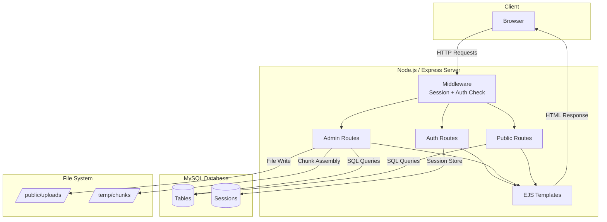
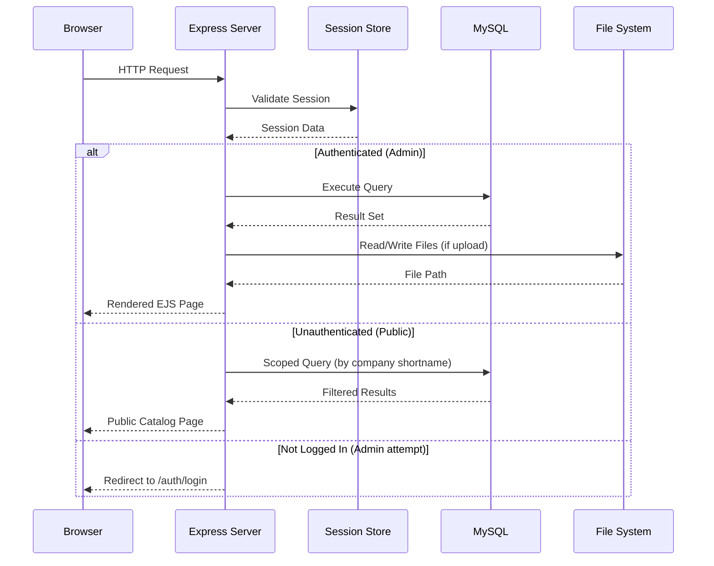
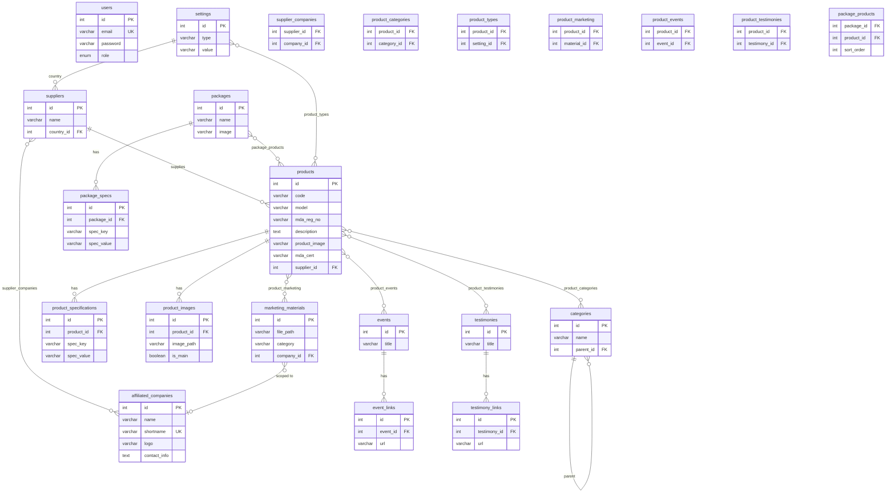
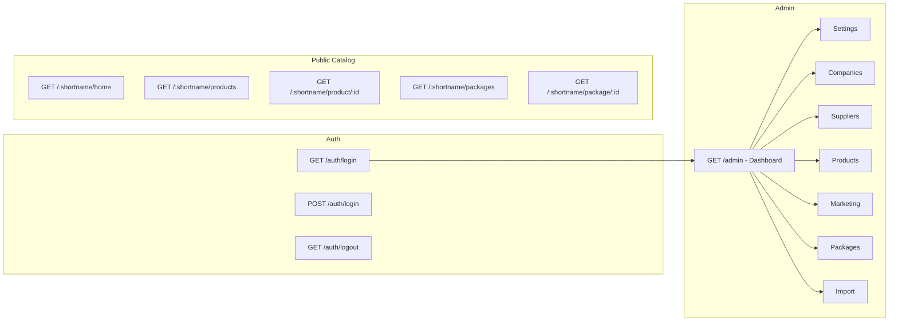
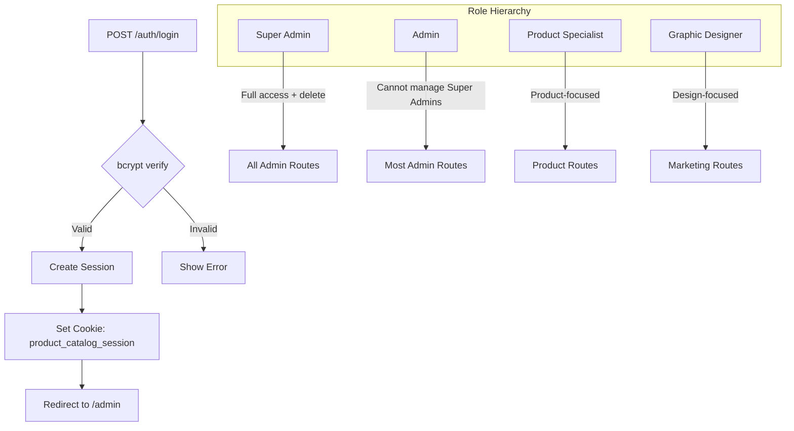

# Product Catalog System

A multi-tenant product catalog management system built with Node.js and Express. It provides an admin panel for managing products, suppliers, companies, marketing materials, and packages, along with a public-facing catalog scoped per affiliated company.

---

## Table of Contents

- [Features](#features)
- [Architecture](#architecture)
- [Tech Stack](#tech-stack)
- [Database Schema](#database-schema)
- [Route Map](#route-map)
- [Getting Started](#getting-started)
- [Environment Variables](#environment-variables)
- [Project Structure](#project-structure)
- [Authentication and Roles](#authentication-and-roles)
- [License](#license)

---

## Features

- **Admin Dashboard** - Overview with counts, monthly deltas, and charts (products per category, top suppliers)
- **Product Management** - Full CRUD with multiple images, MDA certificates, specifications, categories, and types
- **Supplier Management** - CRUD with country association and company linking
- **Affiliated Companies** - Multi-tenant company profiles with logos and branding
- **Marketing Hub** - Materials (brochures, fliers, roll-ups, posters, backdrops), events, and testimonials linked to products
- **Package Builder** - Bundle products into packages with icons, specs, and display ordering
- **Bulk Import** - Excel file import for countries, product types, and categories
- **Public Catalog** - Company-scoped, unauthenticated product/package browsing via URL shortnames
- **Chunked File Uploads** - Large file support with chunk assembly for images, PDFs, and marketing assets
- **Role-Based Access Control** - Four roles with varying permissions across the admin panel

---

## Architecture



### Request Flow



---

## Tech Stack

| Layer | Technology |
|-------|-----------|
| Runtime | Node.js |
| Framework | Express 5.x |
| Templating | EJS + express-ejs-layouts |
| Database | MySQL (via mysql2) |
| Session Store | express-mysql-session |
| Authentication | bcrypt + cookie sessions |
| File Processing | Multer (uploads), Sharp (image resize/WebP) |
| Data Import | xlsx (Excel parsing) |

---

## Database Schema



---

## Route Map



### Admin Sub-routes

| Module | Routes |
|--------|--------|
| Settings | Categories CRUD, Countries/Product Types (via settings), User management |
| Companies | List, Add, Edit, Delete, Chunked logo upload |
| Suppliers | List, Add, Edit, Delete |
| Products | List (with filters), Create, Edit, Delete (Super Admin), Chunked upload |
| Marketing | Materials, Events, Testimonials - each with full CRUD and chunked upload |
| Packages | List, Create, Edit, Delete (Super Admin), Chunked upload |
| Import | Excel upload for countries, product types, categories |

---

## Getting Started

### Prerequisites

- Node.js (v18 or higher recommended)
- MySQL server (v8.x recommended)

### Installation

1. Clone the repository:

```bash
git clone <repository-url>
cd "Product Catalog System"
```

2. Install dependencies:

```bash
npm install
```

3. Create your environment file:

```bash
cp example.env .env
```

4. Configure the `.env` file with your MySQL credentials (see [Environment Variables](#environment-variables)).

5. Start the server:

```bash
npm start
```

The application will automatically create the database, tables, and seed default admin accounts on first run.

6. Open your browser and navigate to `http://localhost:3000/login`.

### Default Accounts

| Email | Password | Role |
|-------|----------|------|
| admin@admin.com | 1234567890 | Super Admin |
| superadmin@admin.com | 1234567890 | Super Admin |

**Important:** Change these credentials immediately in any non-development environment.

---

## Environment Variables

| Variable | Required | Default | Description |
|----------|----------|---------|-------------|
| `DB_HOST` | Yes | - | MySQL host address |
| `DB_USER` | Yes | - | MySQL username |
| `DB_PASSWORD` | Yes | - | MySQL password |
| `DB_NAME` | No | `product_catalog` | Database name |
| `PORT` | No | `3000` | Server port |
| `SESSION_SECRET` | Yes | `secret` | Session encryption key (change in production) |
| `NODE_ENV` | No | `development` | Set to `production` for secure cookies |
| `BASE_DOMAIN` | No | `lvh.me` | Base domain used in templates |

---

## Project Structure

```
Product Catalog System/
├── config/
│   └── database.js          # DB connection pool, schema creation, migrations, seeds
├── routes/
│   ├── auth.js              # Login / logout
│   ├── dashboard.js         # Admin dashboard
│   ├── settings.js          # Categories, countries, product types, users
│   ├── companies.js         # Affiliated companies CRUD
│   ├── suppliers.js         # Suppliers CRUD
│   ├── products.js          # Products CRUD + chunked uploads
│   ├── marketing.js         # Materials, events, testimonials
│   ├── packages.js          # Packages CRUD
│   ├── import.js            # Excel bulk import
│   └── company-public.js    # Public catalog (per-company)
├── views/
│   ├── layout.ejs           # Main layout wrapper
│   ├── admin/               # Admin panel templates
│   ├── public/              # Public catalog templates
│   └── ...                  # Login, error, dashboard
├── public/
│   ├── css/                 # Stylesheets
│   └── uploads/             # Runtime file storage (products, logos, marketing)
├── server.js                # Application entry point
├── package.json             # Dependencies and scripts
├── example.env              # Environment variable template
└── .gitignore
```

---

## Authentication and Roles



### Role Permissions

| Action | Super Admin | Admin | Product Specialist | Graphic Designer |
|--------|:-----------:|:-----:|:-----------------:|:----------------:|
| View Dashboard | Yes | Yes | Yes | Yes |
| Manage Products | Yes | Yes | Yes | Limited |
| Delete Products | Yes | No | No | No |
| Manage Companies | Yes | Yes | Yes | Yes |
| Manage Suppliers | Yes | Yes | Yes | Yes |
| Manage Marketing | Yes | Yes | Yes | Yes |
| Manage Packages | Yes | Yes | Yes | Yes |
| Delete Packages | Yes | No | No | No |
| Manage Users | Yes | Limited | No | No |
| Delete Users | Yes | No | No | No |
| Delete Settings | Yes | No | No | No |
| Import Data | Yes | Yes | Yes | Yes |

---

## License

This project is proprietary. All rights reserved.
